# Bienvenidos

## Challenge - Seguridad Informática 2022 - Manejo de informacion

Para cumplir con el objetivo de asegurar la información proporcionada por el endpoint https://62433a7fd126926d0c5d296b.mockapi.io/api/v1/usuarios y hacerla disponible para su consumo por distintos equipos y aplicaciones de la empresa, se implementarán medidas de seguridad adecuadas. Esto incluirá análisis de almacenamiento seguro de datos, selección de controles y protocolos de seguridad, y garantía de integridad y confidencialidad de la información.

Posteriormente, se proporcionará una explicación detallada de la arquitectura implementada para esta solución.

# **Arquitectura de la solucion implementada**

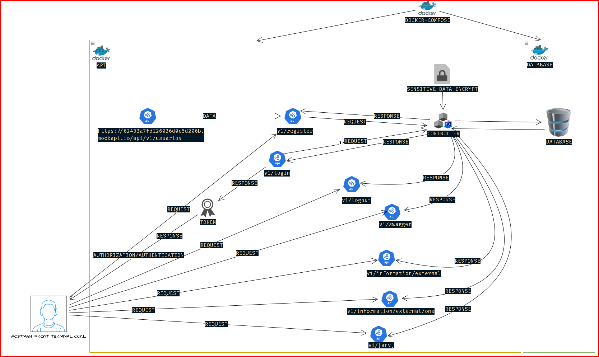

# Explicacion detallada de los temas asociados a la solución implementada:

Se implementaron medidas de seguridad para recibir y almacenar datos de manera segura. Se utilizó bcrypt para el hash de contraseñas y cryptography.fernet AES para la encriptación de datos sensibles en reposo. Además, se aplicó autenticación y autorización mediante JWT para controlar el acceso a los endpoints. Las contraseñas y otros datos confidenciales fueron encriptados para garantizar su seguridad. El token de autenticación tiene una caducidad de 5 minutos, y se establecieron controles para prevenir eliminaciones o actualizaciones no autorizadas. Se utilizan keys específicas para validar la información según el rol del usuario, asegurando que cada usuario acceda solo a los datos permitidos para su rol. Estas keys cambian constantemente para evitar ataques, y el método de encriptación es mayormente irreversible y verificable.

Nota: tener presente que para fines de pruebas y laboratorio existe data fictisia y .env en el repositorio, en las buenas practicas no debe existir.

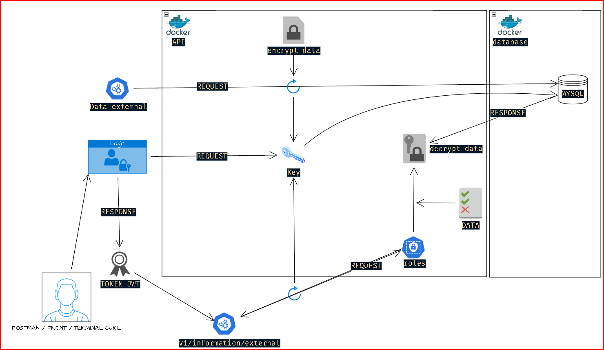

## Criterios de Aceptación en Contraseña:

Se valida que las contraseñas cumplan con criterios específicos, como tener al menos 8 caracteres, una letra mayúscula, una letra minúscula, un número y un carácter especial.

## Autenticación y Autorización JWT (HS512) Firmado:

Se utiliza JWT (JSON Web Tokens) con algoritmo de firma HS512 para autenticar y autorizar las solicitudes a la API.

## Encriptación de Datos en Reposo y Tránsito:

Los datos sensibles se encriptan utilizando el algoritmo AES en modo de operación CBC con una longitud de clave de 128 bits.
La contraseña se hashea utilizando bcrypt, un algoritmo de hashing basado en Blowfish, antes de almacenarse en la base de datos.

## Control de Acceso y Limitación de Solicitudes:

Se implementa un sistema de limitación de solicitudes para evitar ataques de denegación de servicio (DoS).

## Seguridad de la Capa de Transporte (TLS/SSL):

El servidor se ejecuta utilizando un contexto SSL/TLS proporcionado por Flask para garantizar la seguridad de la comunicación entre el cliente y el servidor.

## Cabeceras de Seguridad HTTP:

Se agregan encabezados de seguridad HTTP, como HSTS, CSP, X-Content-Type-Options, X-Frame-Options, Referrer-Policy y X-XSS-Protection, para mitigar varios vectores de ataque.

## Sanitización y Validación de Datos:

Se implementa la sanitización y validación de datos para prevenir inyecciones de código malicioso o datos incorrectos.

## Control de Errores y Sus Códigos:

Se manejan errores de manera adecuada y se proporcionan códigos de estado HTTP correspondientes para una mejor comprensión de los problemas.

## Auditoría con Logs:

Se lleva a cabo una auditoría de eventos importantes mediante el registro de logs, lo que permite realizar un seguimiento de las actividades y detectar posibles problemas de seguridad.

## Variables de Entorno:

Las configuraciones sensibles, como claves secretas, se almacenan en variables de entorno para evitar la exposición accidental en el código.

## Documentación Mediante Swagger No UI:

Se proporciona documentación de la API mediante Swagger para facilitar a los desarrolladores la comprensión de los endpoints y sus parámetros.

## CORS:

Se habilita CORS para permitir solicitudes desde diferentes orígenes, lo que mejora la interoperabilidad de la aplicación.

## Datos Encriptados en la Base de Datos:

Los datos sensibles almacenados en la base de datos se encriptan para protegerlos en reposo.

## Versionamiento de Endpoints:

Se ha implementado un sistema de versionamiento para los endpoints de la API con el fin de mejorar la organización y mantenibilidad del código. Cada conjunto de endpoints relacionados se ha asignado a una versión específica, lo que permite realizar cambios y actualizaciones de manera controlada y sin afectar a otras partes del sistema. Esto se logra incluyendo el número de versión en la URL de la API, lo que facilita la gestión de cambios y la introducción de nuevas características.

## Categorizacion de datos:

*SENSIBLES: (Role admin)*

    credit_card_num: Número de tarjeta de crédito.
    credit_card_ccv: Código de seguridad de la tarjeta de crédito.
    cuenta_numero: Número de cuenta.
    foto_dni: Fotografía del documento de identidad.
    geo_latitud: Coordenada de latitud.
    geo_longitud: Coordenada de longitud.
    ip: Dirección IP.

*PÚBLICOS: (Role user)*

    user_name: Nombre de usuario.
    codigo_zip: Código postal.
    direccion: Dirección.
    color_favorito: Color favorito.
    auto: Marca y modelo del automóvil.
    auto_modelo: Modelo del automóvil.
    auto_tipo: Tipo de automóvil.
    auto_color: Color del automóvil.
    cantidad_compras_realizadas: Cantidad de compras realizadas.
    avatar: Enlace a la imagen de perfil.
    fec_birthday: Fecha de cumpleaños.

*SEMIPRIVADOS: (Role rrhh)*

    fec_alta: Fecha de alta (podría variar dependiendo del contexto).
    id: Identificación.

La clasificación de los datos se determina en función de la cantidad de información recopilada.

Los roles se ajustan estratégicamente al núcleo del negocio, asegurando una alineación efectiva con los objetivos y funciones críticas de la organización

En términos prácticos, resulta inviable clasificar un rol administrativo durante el proceso de registro, ya que esto podría comprometer la seguridad de la aplicación. Por lo tanto, es necesario implementar un filtro de verificación para evitar esta posibilidad.

Con fines de laboratorio, se han definido internamente roles específicos (administrador, usuario, recursos humanos) para categorizar los datos que se mostrarán, ademas de los certificados debido a que tendria que contratar una entidad que me los genere oficialmente.

# Para ejecutar el proyecto, simplemente sigue estos pasos:

## Para clonar el repositorio, puedes utilizar ya sea el método HTTPS o SSH.

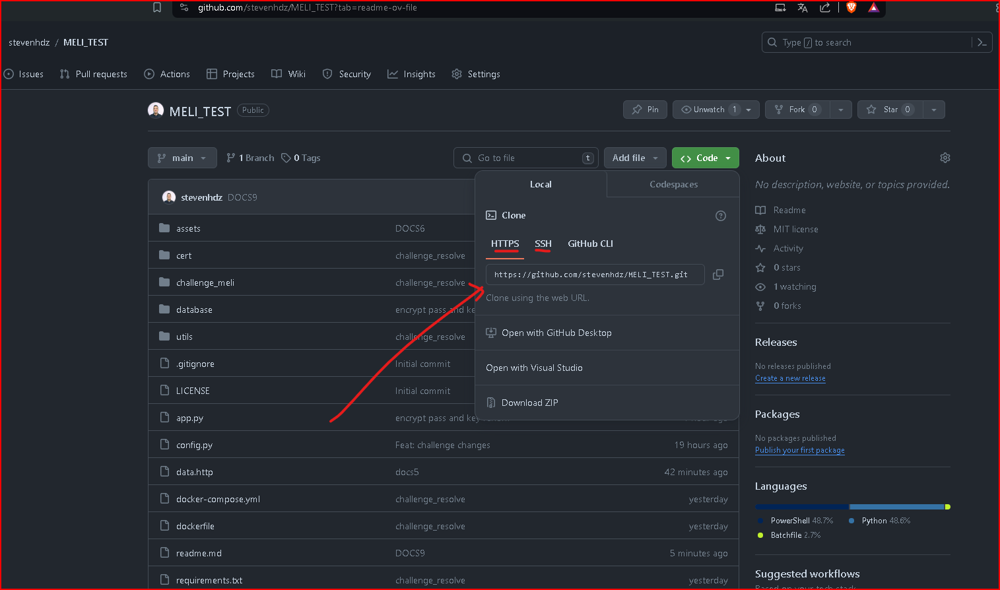

## Abre la terminal y navega hasta la carpeta raíz del repositorio MELITEST. Luego, puedes ejecutar el comando **`docker-compose up`** para instalar y levantar las imágenes junto con su información correspondiente.

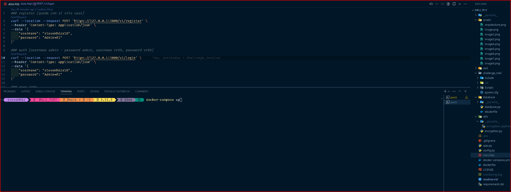

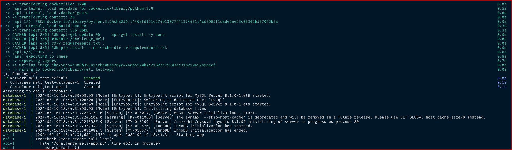

Cuando aparezca el mensaje indicado, indica que la subida se realizó correctamente.

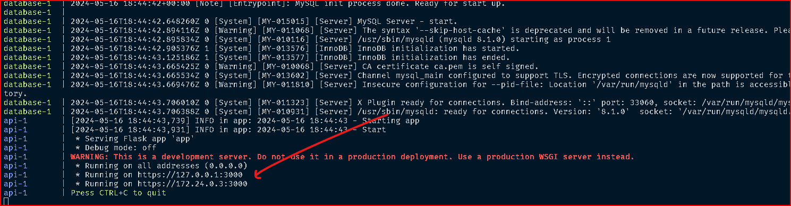

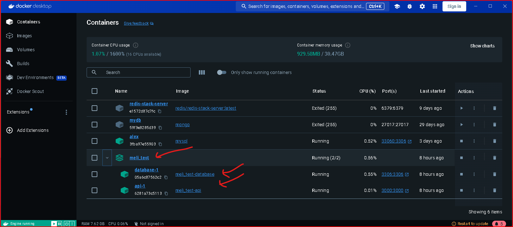

Una vez que las imágenes de Docker hayan sido cargadas, el usuario podrá hacer uso del documento guía de consumo de las APIs. Es importante tener en cuenta que el archivo "data.http" contiene datos ficticios, creados exclusivamente con propósitos prácticos de laboratorio.

Además, se debe asegurar que las imágenes de Docker estén disponibles en una ubicación adecuada y accesible para su utilización en el entorno correspondiente.

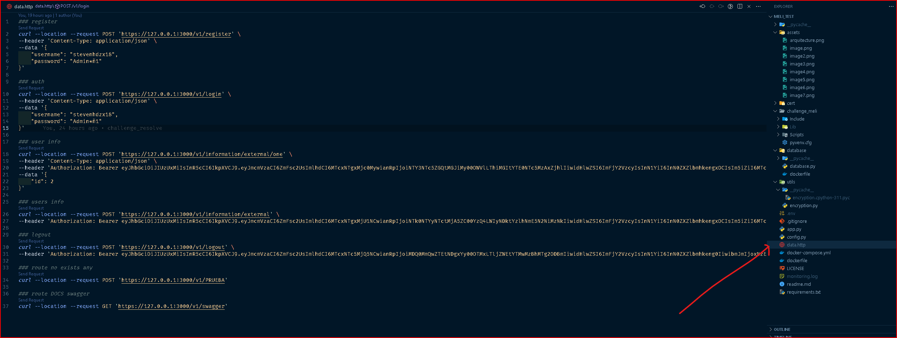

# El funcionamiento de los endpoints es el siguiente:

## EN CASO DADO DE QUE NO TE DEJE ACCEDER

Esto se debe a que los certificados no están firmados por un proveedor válido.

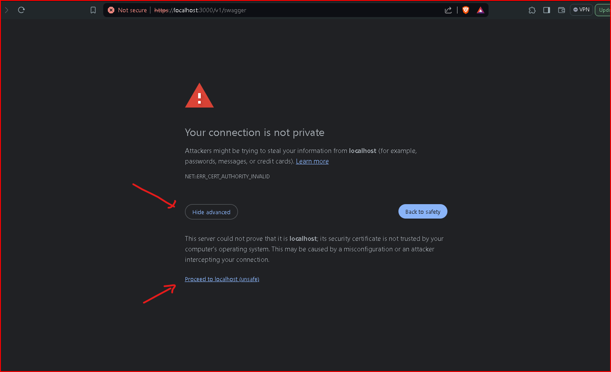

## REGISTRO

Cuando un usuario se registra, se le asigna el rol "USER". Sin embargo, debido a consideraciones de laboratorio, los roles "ADMIN" y "RRHH" se crean automáticamente junto con dos usuarios asociados, cuyas credenciales son:

Usuario Administrador (ADMIN):

Username: admin
Contraseña: admin

Usuario de Recursos Humanos (RRHH):

Username: rrhh
Contraseña: rrhh

Es importante destacar que este procedimiento se realiza únicamente con fines de laboratorio y no es aplicable en entornos reales.

En este endpoint se realiza la validación del usuario para verificar su disponibilidad y se asegura de que la contraseña cumpla con los estándares establecidos.

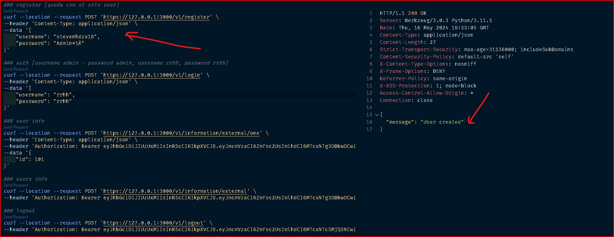

## INICIAR SESION

Al iniciar sesión con las credenciales proporcionadas, se valida la existencia del usuario y se verifican las credenciales con las versiones encriptadas almacenadas en reposo en la base de datos. Si las credenciales son válidas, se devuelve un access_token. En este caso, no se optó por utilizar refresh_token, pero es una opción viable para implementar si es necesario.

El token tiene un tiempo de vida de 5 minutos.

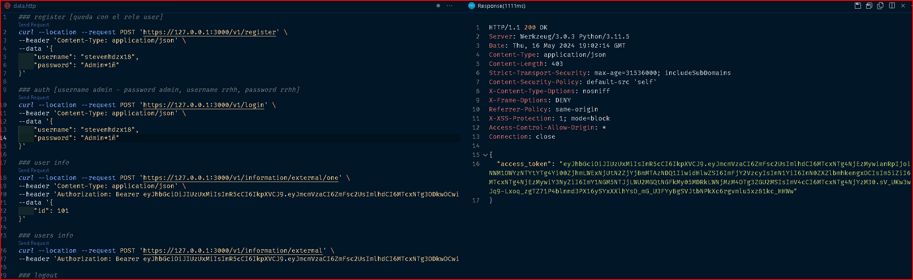

## LISTAR USUARIO DE API EXTERNA

En este endpoint es importante destacar que solo se mostrará la información disponible en el momento de ejecutar la aplicación en el contenedor Docker. Puedes consultar esta información utilizando su identificador (ID). Además, es crucial tener en cuenta que la visualización de los datos estará restringida según el rol del usuario. Los datos estarán cifrados para aquellos usuarios que no tengan permiso para acceder a ellos, de acuerdo con la clasificación de datos y sus respectivos roles.

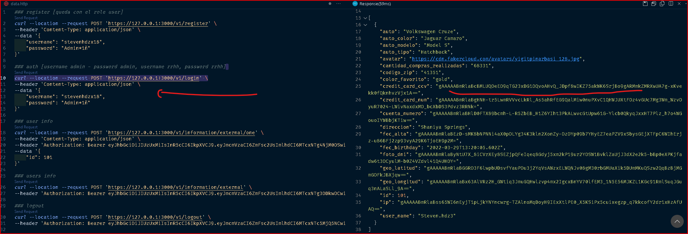

## LISTAR TODA LA INFORMACION EXTERNA

En este endpoint, es esencial tener en cuenta que la información se mostrará de acuerdo al rol del usuario en el sistema. Esto significa que, aunque se muestre toda la información disponible en el momento de ejecutar la aplicación en el contenedor Docker, los datos serán filtrados según los permisos asociados al rol del usuario. Es decir, cada usuario solo podrá ver la información para la cual tiene autorización de acceso según su rol asignado.

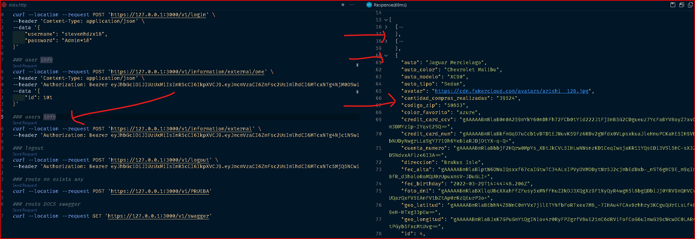

## CERRAR SESIÓN

En este endpoint, tenemos la capacidad de cerrar la sesión del usuario, lo cual es fundamental para evitar que la sesión permanezca abierta y sea vulnerable a suplantaciones u otros riesgos de seguridad.

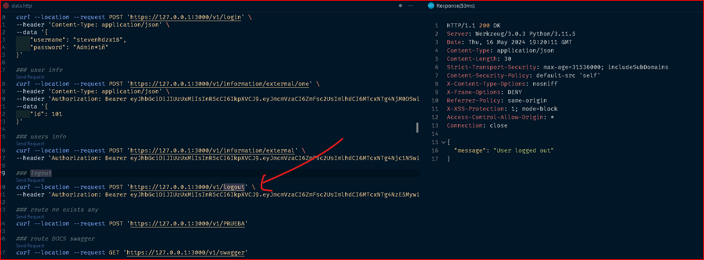

## VALIDACION DE RUTAS NO ACCESIBLES O NO EXISTENTES

En este endpoint, la validación se enfoca en impedir que el usuario acceda a secciones no autorizadas o que no existen en la aplicación. Esto se logra verificando que las rutas a las que intenta acceder no estén permitidas o no existan en el sistema.


## SWAGGER DOCUMENTACION APIS

Puedes acceder a la documentación completa de nuestra API navegando a la ruta /swagger en tu navegador web. Una vez allí, encontrarás una lista de todos los endpoints disponibles, junto con una descripción de lo que hace cada uno.

Además, cada endpoint está acompañado de información detallada sobre los tipos de datos que se pueden enviar en las solicitudes y las respuestas que se esperan recibir. Esto te ayudará a comprender cómo interactuar con la misma.

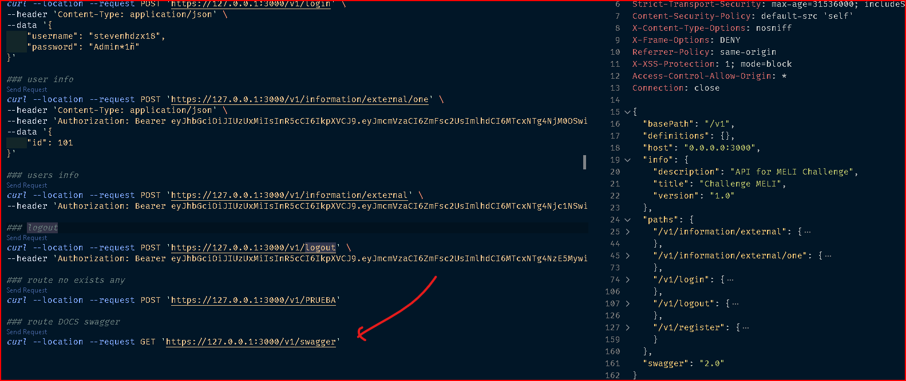

# Observaciones en la seguridad del Endpoint suministrado en el challenge

El endpoint presenta varias observaciones de seguridad que deben abordarse para garantizar la protección de los datos y la privacidad de los usuarios:

## Divulgación de datos sensibles:

El endpoint expone datos que podrían considerarse sensibles, como información personal o confidencial, sin ningún tipo de protección o restricción.

## Exposición a ataques de fuerza bruta:

El método GET utilizado en el endpoint puede ser vulnerable a ataques de fuerza bruta, donde un atacante podría intentar acceder a los recursos mediante la generación de múltiples solicitudes automatizadas, lo que podría resultar en una sobrecarga del sistema o acceso no autorizado.

## Violación de la privacidad del usuario:

La información del usuario puede estar siendo expuesta sin su consentimiento o conocimiento, lo que representa una violación de su privacidad.

## Riesgo de exposición de datos personales:

Al permitir el acceso a todos los datos de forma indiscriminada a través del método GET, se corre el riesgo de exponer datos personales tanto de forma individual como en conjunto, lo que podría tener graves implicaciones para la privacidad de los usuarios.

## Vulnerabilidades de seguridad:

La falta de un método de autenticación y verificación deja al sistema vulnerable a todo tipo de ataques, ya que no se requiere ninguna forma de identificación para acceder a los recursos, lo que facilita el acceso no autorizado y la manipulación de datos.

## Acceso completo sin autenticación:

Se puede acceder a toda la información almacenada en el sistema sin autenticación, lo que representa un riesgo significativo de divulgación de datos sensibles y violación de la privacidad del usuario.

## Manipulación de datos sin autenticación:

Se pueden realizar operaciones de actualización y eliminación de datos sin ningún tipo de autenticación, lo que facilita la manipulación no autorizada de la información almacenada en el sistema.

## Límite de creación sin autenticación:

Aunque hay un límite de 100 elementos para la creación de nuevos datos, sigue siendo posible realizar este proceso sin autenticación, lo que podría ser explotado por un atacante para saturar el sistema con datos falsos o basura.

Consulta de información individual sin autenticación:


Permite consulta informacion individual:


Actualización sin autenticación:


Eliminación sin restricciones:


Límite de creación de 100 elementos:


Metodos permitidos en el endpoint, sin headers se seguridad:


Saludos, quedo atento a sus comentarios

Cualquier cosa por favor contactarme.

Comandos que se utilizaron para la creacion proyecto de forma local

```sh {"id":"01HXFK772Y1JSCTRWKHTRBMBPR"}
python3 -m venv [name]


```

```sh {"id":"01HXFK6EGJDNRR2KN37HQDB9BE"}
Scripts\activate


```

```sh {"id":"01HXFK65VYBAW1T691XVJ7NQTQ"}
pip install -r ./requirements.txt


```

Comando usados para generar los certificados con la entidad OPENSSL

```sh {"id":"01HXHPSH7W6TRVTYY6943MRHTG"}
openssl genrsa -out key.pem 4096


```

```sh {"id":"01HXHPSPBC907BPB81FTEMXEFJ"}
openssl req -new -key key.pem -out csr.pem -sha512


```

```sh {"id":"01HXHPSX13PNX7V18WVZE9M0SF"}
openssl x509 -req -days 365 -in csr.pem -signkey key.pem -out cert.pem -sha512


```
