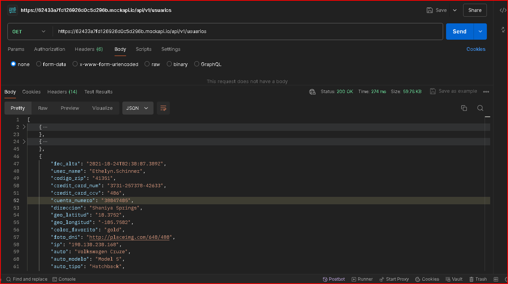
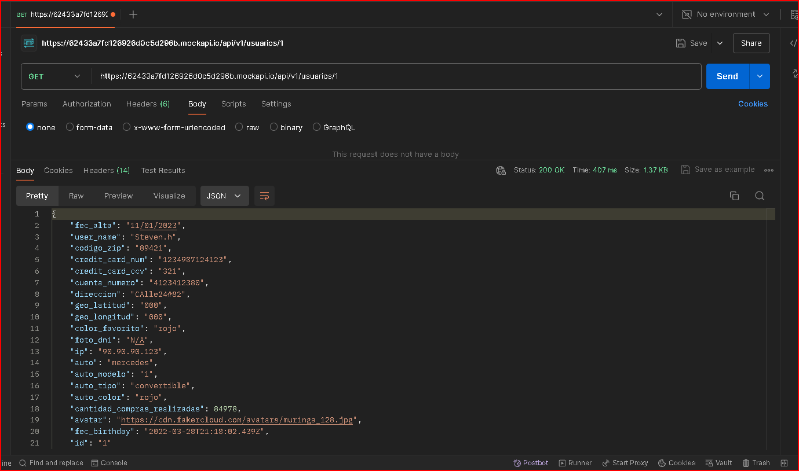
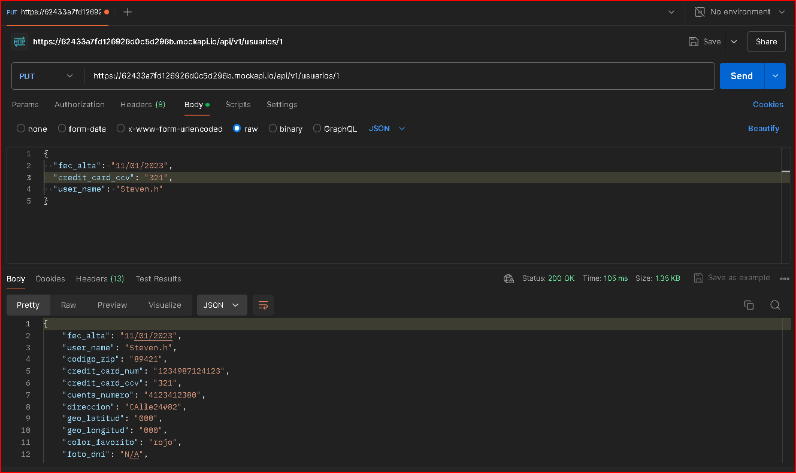
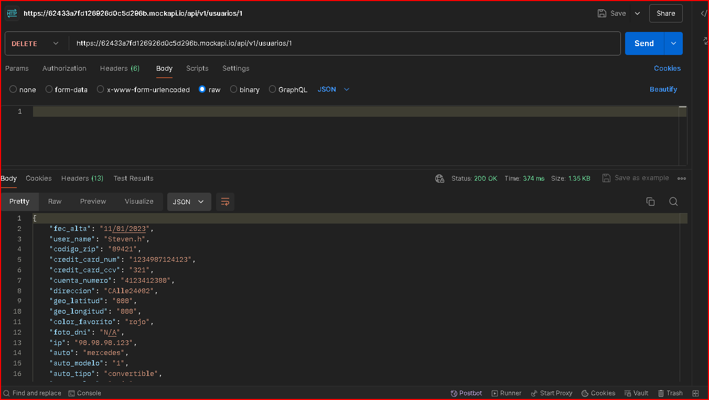
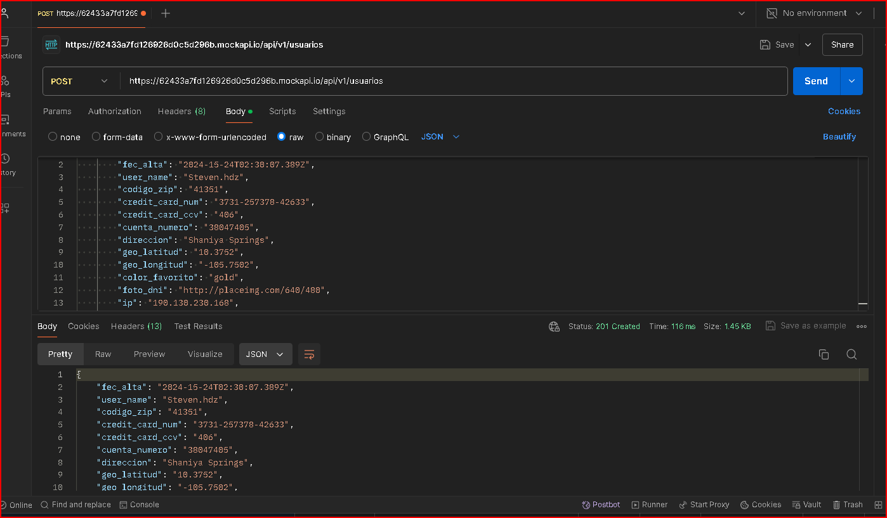
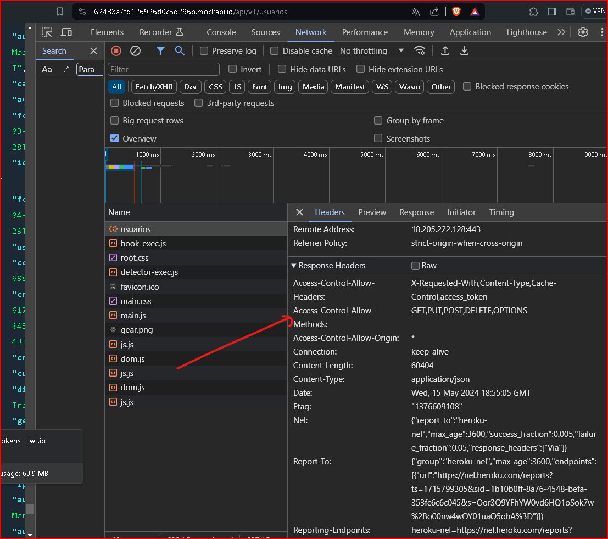
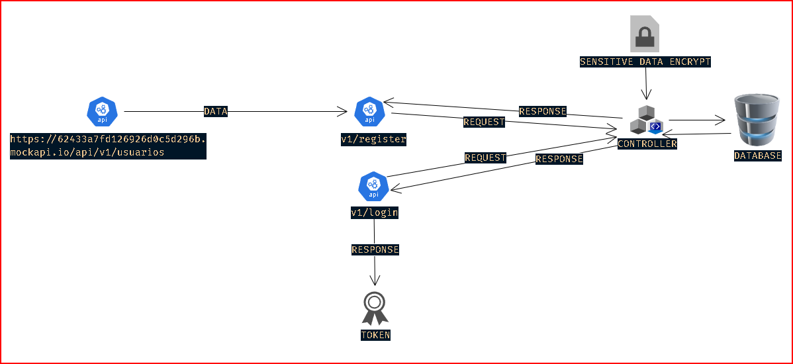

Bienvenido a mi solucion al problema.


El endpoint presenta varias observaciones de seguridad que deben abordarse para garantizar la protección de los datos y la privacidad de los usuarios:

Divulgación de datos sensibles: 

    El endpoint expone datos que podrían considerarse sensibles, como información personal o confidencial, sin ningún tipo de protección o restricción.

Exposición a ataques de fuerza bruta: 

    El método GET utilizado en el endpoint puede ser vulnerable a ataques de fuerza bruta, donde un atacante podría intentar acceder a los recursos mediante la generación de múltiples solicitudes automatizadas, lo que podría resultar en una sobrecarga del sistema o acceso no autorizado.

Violación de la privacidad del usuario: 
    
    La información del usuario puede estar siendo expuesta sin su consentimiento o conocimiento, lo que representa una violación de su privacidad.

Riesgo de exposición de datos personales: 
    
    Al permitir el acceso a todos los datos de forma indiscriminada a través del método GET, se corre el riesgo de exponer datos personales tanto de forma individual como en conjunto, lo que podría tener graves implicaciones para la privacidad de los usuarios.

Vulnerabilidades de seguridad: 

    La falta de un método de autenticación y verificación deja al sistema vulnerable a todo tipo de ataques, ya que no se requiere ninguna forma de identificación para acceder a los recursos, lo que facilita el acceso no autorizado y la manipulación de datos.

Acceso completo sin autenticación: 
    
    Se puede acceder a toda la información almacenada en el sistema sin autenticación, lo que representa un riesgo significativo de divulgación de datos sensibles y violación de la privacidad del usuario.

Manipulación de datos sin autenticación: 
    
    Se pueden realizar operaciones de actualización y eliminación de datos sin ningún tipo de autenticación, lo que facilita la manipulación no autorizada de la información almacenada en el sistema.

Límite de creación sin autenticación: 
    
    Aunque hay un límite de 100 elementos para la creación de nuevos datos, sigue siendo posible realizar este proceso sin autenticación, lo que podría ser explotado por un atacante para saturar el sistema con datos falsos o basura.


Consulta de información individual sin autenticación:



Permite consulta informacion individual:



Actualización sin autenticación:



Eliminación sin restricciones:



Límite de creación de 100 elementos:



Metodos permitidos en el endpoint, sin headers se seguridad:



Para la ejeucion del proyecto, solo basta con ejecutar lo siguiente una vez descargado el repositorio en su equipo.

```sh {"id":"01HXHPV3FMD95F4KRHHCWDSJGP"}
docker-compose up

```

Para probar esta el archivo data.http pero para ello debes instalar la extension en vscode llamada REST Client.

En caso de no tenerla o presentar problemas puede acceder a:
https://127.0.0.1:3000/v1/swagger
En la cual esta documentada las apis que se usaran.

Descripcion realizada, supuestos, problemas, soluciones, evidencias png:

Inicialmente en la api suministrada:

Encuentro varias observaciones como:



Debido a esto mi solucion es llevarlo a tener mas seguridad, donde se implemento lo siguiente:

Seguridad simetrica
Criterios de aceptacion en contraseña
Autenticación y Autorización jwt (HS512) firmado.
Encriptación de Datos en repoto y transito bcrypt (hashing basado en Blowfish) y cryptography.fernet algoritmo AES (Advanced Encryption Standard) en modo de operación CBC (Cipher Block Chaining) con una longitud de clave de 128 bits.
Control de Acceso y Limitación de Solicitudes
Seguridad de la Capa de Transporte (TLS/SSL)
Cabeceras de Seguridad HTTP
Sanitización de datos
Validacion de datos
Control de errores y sus codigos
Auditoria con logs
variables de entorno
documentacion mediantes swagger no UI
CORS
Datos encriptados en BD

El problema percibido es que por falta de informacion no se puede evidenciar quien si observara los datos en crudo y quien no.

SENSIBLES:

    credit_card_num: Número de tarjeta de crédito.
    credit_card_ccv: Código de seguridad de la tarjeta de crédito.
    cuenta_numero: Número de cuenta.
    foto_dni: Fotografía del documento de identidad.
    geo_latitud: Coordenada de latitud.
    geo_longitud: Coordenada de longitud.
    ip: Dirección IP.

PÚBLICOS:

    user_name: Nombre de usuario.
    codigo_zip: Código postal.
    direccion: Dirección.
    color_favorito: Color favorito.
    auto: Marca y modelo del automóvil.
    auto_modelo: Modelo del automóvil.
    auto_tipo: Tipo de automóvil.
    auto_color: Color del automóvil.
    cantidad_compras_realizadas: Cantidad de compras realizadas.
    avatar: Enlace a la imagen de perfil.
    fec_birthday: Fecha de cumpleaños.

SEMIPRIVADOS:

    fec_alta: Fecha de alta (podría variar dependiendo del contexto).
    id: Identificación.

Segun la suma de informacion se le da una clasificacion a los datos.

va adapatado al core del negocio los roles

pero se debe tener en cuenta lo siguiente:

        Para fines pracricos no es viable que al momento del registro, se clasificaque el role administrativo lo cual puede comprometer toda la aplicacion para esto se debe hacer un filtro de verificacion

cifrado sobre...

El otro problema percibido es que todos los datos mencionados tienden a ser sensibles por ende debe ser encriptados en su mayoria, por lo tanto no hay datos normales que puedan ser mostrados sin problema.

Analisis de riesgo en la solucion planteada.

Para la creacion proyecto de forma local se utilizaron los siquientes comandos:

```sh {"id":"01HXFK772Y1JSCTRWKHTRBMBPR"}
python3 -m venv [name]

```

```sh {"id":"01HXFK6EGJDNRR2KN37HQDB9BE"}
Scripts\activate

```

```sh {"id":"01HXFK65VYBAW1T691XVJ7NQTQ"}
pip install -r ./requirements.txt

```

```sh {"id":"01HXFPKKM6AT4NBD8T785Z0Y9F"}
docker build -t myapp .

```

```sh {"id":"01HXFPKVCJXH432NTJ1XTG06GH"}
docker run -p 3000:3000 myapp

```

```sh {"id":"01HXHPSH7W6TRVTYY6943MRHTG"}
openssl genrsa -out key.pem 4096

```

```sh {"id":"01HXHPSPBC907BPB81FTEMXEFJ"}
openssl req -new -key key.pem -out csr.pem -sha512

```

```sh {"id":"01HXHPSX13PNX7V18WVZE9M0SF"}
openssl x509 -req -days 365 -in csr.pem -signkey key.pem -out cert.pem -sha512

```
